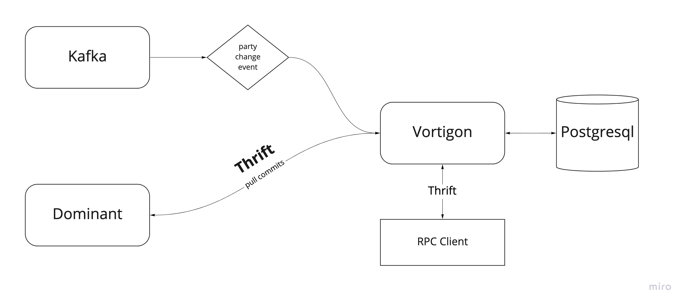

# vortigon

Сервис предназначен для сбора всех возможных событий и данных в системе
для последующей агрегации и предоставления поиска нужной информации

Общая схема работы сервиса:

Из схемы видно, что сервис слушает события из Kafka и pull'ит коммиты из Dominant сервиса

Что касается Kafka. В текущей реализации **vortigon** слушает события `PartyChange` и
не хранит историю изменений записывая только последнее состояние

Из Dominant **vortigon** собирает только те коммиты, которые направлены на создание/изменение категории магазина

Общение с сервисом реализовано посредством RPC (Apache Thrift). Для этого **vortigon** реализует [протокол](https://github.com/rbkmoney/party-shop-proto). 
